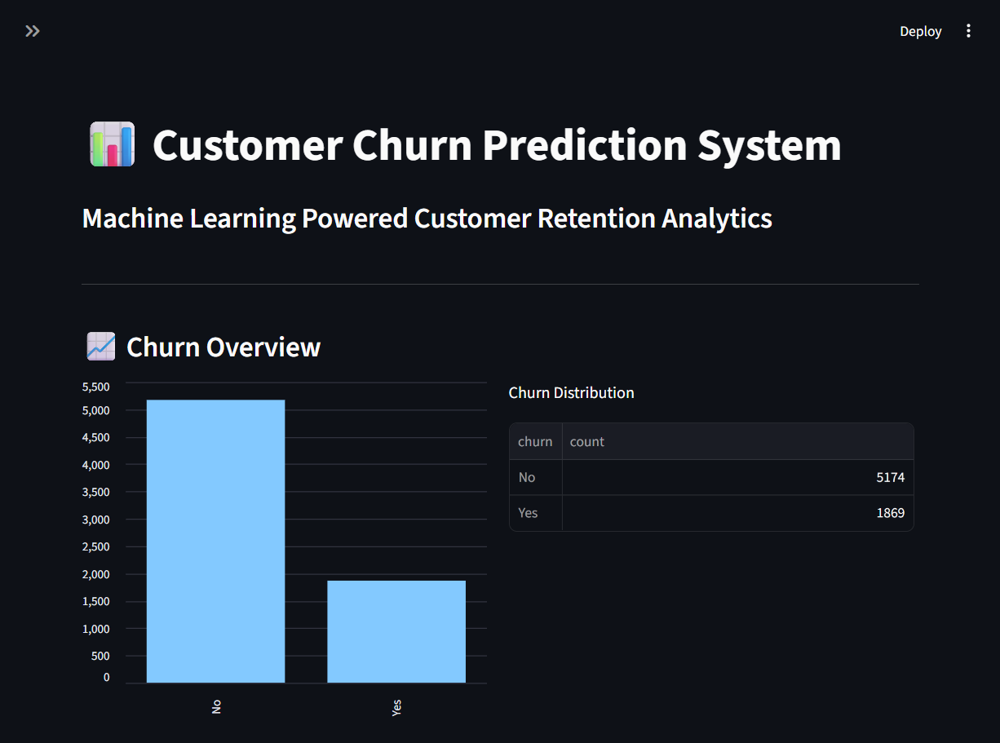
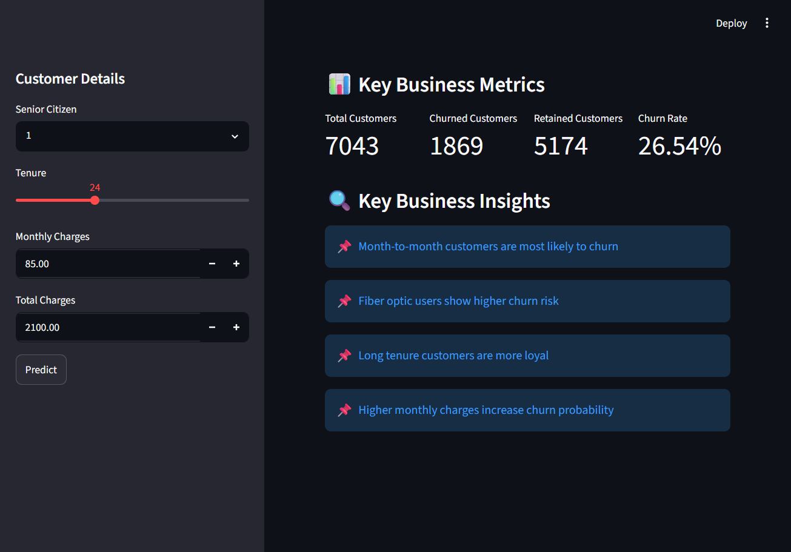
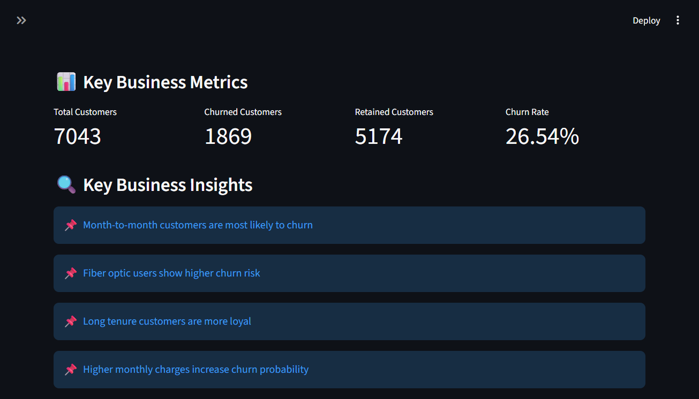

# 📊 Customer Churn Prediction System

## 📌 Overview

The Customer Churn Prediction System is a Machine Learning project developed to predict whether a telecom customer is likely to churn (leave the service). The application provides an interactive dashboard where users can enter customer details and receive a churn prediction along with the estimated probability.

The project also includes business insights that help understand customer retention patterns and support data-driven decision-making.

---

## 🚀 Features

* Predict customer churn using a trained Machine Learning model
* Interactive web application built with Streamlit
* Customer churn probability prediction
* Business insights dashboard
* PostgreSQL database integration
* Automatic CSV fallback if the database is unavailable
* Clean and user-friendly interface

---

## 🛠️ Tech Stack

* Python
* Streamlit
* Pandas
* NumPy
* Scikit-learn
* PostgreSQL
* Joblib
* Git & GitHub

---

## 📁 Project Structure

```text
Customer-Churn-LTV-Project/
│
├── dashboard/
│   └── dashboard.py
│
├── data/
│   └── processed_churn_data.csv
│
├── models/
│   └── churn_rf_model.pkl
│
├── src/
│   ├── __init__.py
│   ├── database.py
│   └── predict.py
│
├── notebooks/
├── requirements.txt
├── README.md
└── .gitignore
```

---

## ⚙️ Installation

Clone the repository:

```bash
git clone <your-github-repository-url>
```

Navigate to the project folder:

```bash
cd Customer-Churn-LTV-Project
```

Create a virtual environment:

```bash
python -m venv .venv
```

Activate the virtual environment:

### Windows

```bash
.venv\Scripts\activate
```

Install dependencies:

```bash
pip install -r requirements.txt
```

Run the application:

```bash
python -m streamlit run dashboard/dashboard.py
```

---

## 📊 Dashboard Features

* Churn overview visualization
* Customer statistics
* Churn rate calculation
* Interactive prediction form
* Churn probability display
* Business recommendations

---

## 🤖 Machine Learning Model

* Algorithm: Random Forest Classifier
* Task: Binary Classification
* Target Variable: Customer Churn (Yes/No)

---

## 💡 Business Insights

* Month-to-month contract customers are more likely to churn.
* Customers with longer tenure are more likely to remain loyal.
* Higher monthly charges are associated with increased churn risk.
* Fiber optic customers tend to have higher churn rates.

---

## 📷 Project Screenshots

### Dashboard Home


### Prediction Input


### Prediction Result


### Business Metrics


---

## 🔮 Future Improvements

* Customer Lifetime Value (LTV) prediction
* Additional interactive charts and filters
* Authentication and user management
* REST API integration
* Enhanced analytics dashboard

---

## 👩‍💻 Author

**Sujitha Anbazhagan**

Machine Learning & Data Analytics Project

---

## 📜 License

This project is developed for educational and portfolio purposes.
